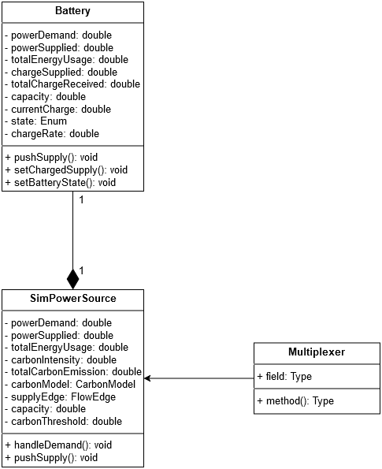
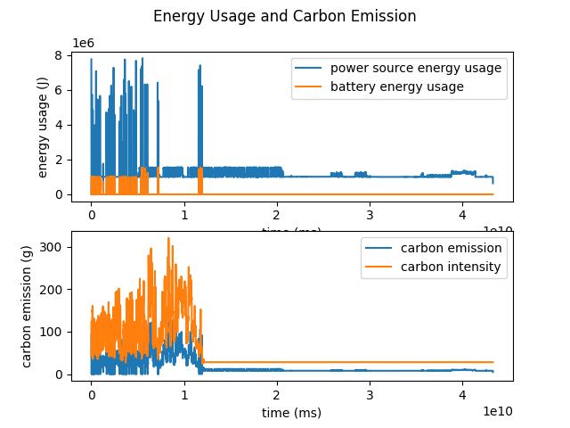

# Battery

Each power source manages a battery that can be used to store and supply energy to the multiplexer. Each battery has three states: Idle, Charging and Supplying. Each battery has a policy that dictates it's behavior. There are three policies: carbon based, power demand based, and cyclic.

## Input
Battery properties are specified in JSON

```json
"battery": {
	"description": "Battery used by the power source",
	"type": "object",
	"properties": {
		"policy": {
			"description": "The policy type of the battery",
			"type": "string"
		},
		"policyThreshold": {
			"description": "Threshold value for the policy",
			"type": "number"
		},
		"capacity": {
			"description": "The maximum energy capacity of the battery",
			"type": "number",
		},
		"chargeRate": {
			"description": "The charging rate of the battery",
			"type": "number",
		}
},
"required": [
	"policy",
	"policyThreshold",
	"capacity",
	"chargeRate"
]
```
They are written in the topology files, there is one for each cluster.
```json
{
  "clusters": [
    {
      "name": "C01",
      "hosts": [
        {
          "name": "H01",
          "cpu": {
            "coreCount": 12,
            "coreSpeed": 3300
          },
          "memory": {
            "memorySize": 140457600000
          }
        }
      ],
      "battery": {
        "policy": "carbon",
        "policyThreshold": 100,
        "capacity": 300000,
        "chargeRate": 300
      }
    }
  ]
} 
```
## Design


## Example
An experiment using all three policies is available in the experiment folder.  To run it, you can download this repository and run ExperimentCli with the following argument:

	--experiment-path "simulation-experiment/inputs/experiments simple_experiment.json"

The results will be placed in the output folder. From the battery file, you can read the following columns:

	['timestamp' 'timestamp_absolute' 'hosts_connected' 'power_draw'  'energy_usage' 'current_capacity' 'power_demand' 'charge_supplied'  'total_charge_received' 'battery_state']

The energy usage and carbon emissions can be shown by running the demo.py file, which will show the following figure:




